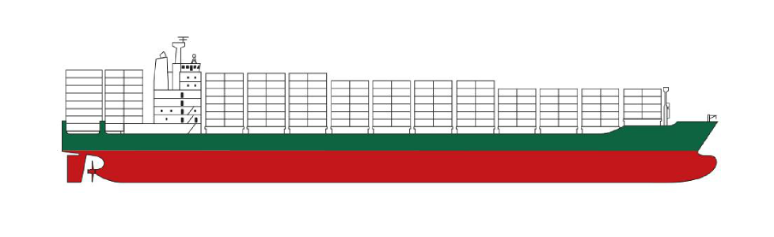

# info-uss-fitzgerald

On June 17, 2017 (early morning local time), the USS <i>Fitzgerald</i> (DDG-62) was involved in a collision with the MV <i>ACX Crystal</i> about 100 km from her homeport of Yokosuka, Japan. The collision caused significant damage to the <i>Fitzgerald</i>, killing seven sailors and injuring three, including the commanding officer. The investigation into the incident is still ongoing as of June 28th, 2017.

After hearing news of this incident, I was saddened and curious about what might have happened and began reading up on what was known about the incident at that time, and learning more about the USS <i>Fitzgerald</i> and the <i>Arleigh Burke</i>-class destroyers. The following summary is a simple size comparison of the two ships involved and a highlight of the surface level damages based on initial photographs.

<h1>USS <i>Fitzgerald</i></h1>

The USS <i>Fitzgerald</i> (DDG-62) is a Flight I <i>Arleigh Burke</i>-class destroyer, commissioned by the USN in 1995. It is 154 meters long, displaces about 9000 tons full, has a draft of 9.4 meters and a crew of more than 200 sailors.  

<h1>MV <i>ACX Crystal</i></h1>

The MV <i>ACX Crystal</i> is a Phillipine-owned container ship built in South Korea in 2008. It is 222.6 meters long, with a deadweight of 39,565 tons, a capacity of 2858 TEU, draft of 12 meters and a crew of 20. 

<h1>Damage</h1>

During the collision, the USS <i>Fitzgerald</i> was struck and damaged on its starboard side, while the MV <i>ACX Crystal</i> was struck and damaged on its port side. The <i>Fitzgerald</i> suffered significant damage above and below the water line and likely began taking on water immediately. Additional details on the aftermath of the collision can be found in the additional reading linked below.

Damage to the significantly larger MV <i>ACX Crystal</i> appears to be much less, with the only visibile damage being the slightly bent hull on the port side near the bow.

One thing to note in the above photograph is how the <i>ACX Crystal</i> appears to be running at a relatively high draft, indicating that the ship was not running at max capacity. This is speculation however based on my limited naval knowledge.

<h1>Size and Damage Comparison</h1>

In reviewing photographs of the two ships and reading comparisons of their respective specifications, I could not find a visual comparison of the ships to help visualize both the collision and the cause of damage. I then attempted a simplistic comparison of the relative sizes of these two ships, while also highlighting the damaged areas.

I first found a detailed illustration of a Flight I <i>Arleigh Burke</i>-class destroyer to represent the USS <i>Fitzgerald</i>.

For the <i>ACX Crystal</i>, I was unable to a find a detailed illustration of the ship but I was able to find an illustration of a similarly sized container ship with a capacity of 2824 TEU (compared to the <i>AC Crystal</i>'s capacity of 2858 TEU.

Next, I simply scaled the size of the ships by their actual lengths (154 meters and 222.6 meters) relative to an estimated bow-to-stern length from their illustrations. No adjustments were made to estimate the relative height of the ships.

In the image above, I also attempted to show the following...

<ul>
<li>Estimated draft of the MV <i>ACX Crystal</i> estimated from photographs.</li>
<li>The rough area (above and below the waterline) of the <i>ACX Crystal</i> that would have impacted the <i>Fitzgerald</i>, highlighted in green and red on the <i>Fitzgerald</i>.
<li>The areas of damage on both the <i>Fitzgerald</i> and the <i>ACX Crystal</i>, highlighted in yellow, as estimated from the photographs of both ships.
</ul>

<h1>Notes</h1>

In reviewing this visual comparison, the relative size of these ships is much more apparent. Additionally, the extent of the damage to the <i>Fitzgerald</i> takes on new light, especially in consideration of what appears to be the small draft of the <i>ACX Crystal</i> at the time of the collision (at least based on a rough estimate of ship size comparison, draft levels, and damage locations).  

Based on initial reports, the damaged area of the <i>Fitzgerald</i> below the waterline included the berthing quarters, damage which resulted in the deaths of seven sailors. And of particular note in the above comparison is the likely impact that the bulbous bow of the <i>ACX Crystal</i> had on the structure of the <i>Fitzgerald</i> below the waterline, possibily exacerbated by the small draft of the <i>ACX Crystal</i>. 

<h1>Additional Reading</h1>

"Investigators Believe USS Fitzgerald Crew Fought Flooding For An Hour Before Distress Call Reached Help" by Sam LaGrone for USNI 
<a href="https://news.usni.org/2017/06/21/investigators-believe-uss-fitzgerald-crew-fought-flooding-for-an-hour-before-distress-call-reached-help" target="_blank">https://news.usni.org/2017/06/21/investigators-believe-uss-fitzgerald-crew-fought-flooding-for-an-hour-before-distress-call-reached-help</a>

"USS Fitzgerald and MV ACX Crystal Collision", Wikipedia 
<a href="https://en.wikipedia.org/wiki/USS_Fitzgerald_and_MV_ACX_Crystal_collision" target="_blank">https://en.wikipedia.org/wiki/USS_Fitzgerald_and_MV_ACX_Crystal_collision</a>

"HOW COULD THIS HAPPEN? THE FITZGERALD, THE U.S. NAVY, AND COLLISIONS AT SEA" by Bryan Mcgrath for War On The Rocks 
<a href="https://warontherocks.com/2017/06/how-could-this-happen-the-fitzgerald-the-u-s-navy-and-collisions-at-sea/" target="_blank">https://warontherocks.com/2017/06/how-could-this-happen-the-fitzgerald-the-u-s-navy-and-collisions-at-sea/</a>

"Maritime Mystery: Why a U.S. Destroyer Failed to Dodge a Cargo Ship" by Scott Shane for NYT 
<a href="https://www.nytimes.com/2017/06/23/world/asia/destroyer-fitzgerald-collision.html" target="_blank">https://www.nytimes.com/2017/06/23/world/asia/destroyer-fitzgerald-collision.html</a>

Bryan McGrath, Twitter Thread - June 16, 2017 
<a href="https://twitter.com/ConsWahoo/status/875860087683907584" target="_blank">https://twitter.com/ConsWahoo/status/875860087683907584</a>

Also, in looking up information on this incident, I came across some interesting Twitter accounts on naval and defense news that I started following.
<ul>
<li><a href="https://twitter.com/ConsWahoo" target="_blank">@ConsWahoo</a></li>
<li><a href="https://twitter.com/HerbCarmen" target="_blank">@HerbCarmen</a></li>
<li><a href="https://twitter.com/DavidLarter" target="_blank">@DavidLarter</a></li>
<li><a href="https://twitter.com/StratSentinel" target="_blank">@StratSentinel</a></li>
</ul>
